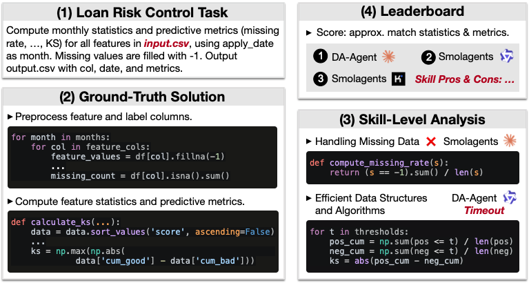

<div align= "center">
    <h1>AgenticDataBench: A Comprehensive Benchmark for Data Agents</h1>
</div>


<br>

<div align="center">

</div>

<br>

AgenticDataBench is a comprehensive benchmark for evaluating LLM-based data agents that automate real-world data science workflows. It addresses the lack of rigorous evaluation by providing diverse, realistic tasks with fine-grained ground-truth labels.

The benchmark spans 15 domains, including real B2B fintech use cases, and is structured around reusable data science skills—core operational patterns extracted from large-scale task solutions (see [`skill_cluster`](./skill_cluster)). It combines curated real-world tasks with systematically generated ones (see [`generator`](./generator)) to ensure broad coverage and minimal redundancy.

AgenticDataBench enables detailed evaluation of data agents, offering both overall accuracy and fine-grained, skill-level performance insights.

## Community

We deeply appreciate the invaluable effort contributed by our dedicated team of developers, supportive users, and esteemed industry partners.

- [Tsinghua University](https://www.tsinghua.edu.cn/en)
- [Ant Digital Technologies, Ant Group](https://intl.antdigital.com/en)

<span id="-quickstart"></span>

## Quickstart

### 📦 Data Downloading

Download the domain datasets from [HuggingFace](https://huggingface.co/datasets/shawnzzzh/AgenticDataBench) and unzip into `testbed/datasets/`.

### 🔑 Set API Keys

Configure your API keys in a `.env` file:

```bash
# For Qwen models (DashScope)
echo "DASHSCOPE_API_KEY=your_key_here" > .env
```

### 🔧 Installation

```bash
pip install -r testbed/requirements.txt
```

### 🚀 Run Benchmark

You can also explore task generation and skill construction via [`generator`](./generator) and [`skill_cluster`](./skill_cluster).

```bash
# For da-agent
cd testbed && ./run_da_agent.sh

# For smolagents
cd testbed && ./run_smolagents.sh
```

After running, evaluate the results:

```bash
cd testbed
python3 evaluate.py --output_dir output/da-agent-qwen-{experiment_id}
```

<div align="center">

</div>

## 📊 Result Uploading

Benchmark results are stored in `testbed/results`.