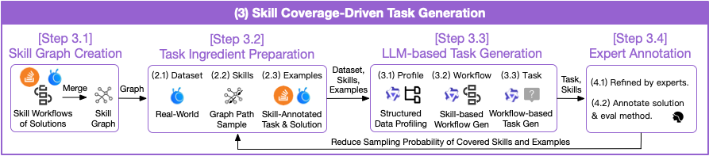

# AgenticDataBench — Generator

Skill coverage-driven task generation for benchmarking data science AI agents. A weighted skill graph is built from StackOverflow traces (nodes = skills, edges = consecutive usage, weights = frequency). Tasks are synthesized by sampling skill paths, pairing with domain datasets and skill-relevant examples, then prompting an LLM to produce structured workflows.

## Generation Pipeline



**Step 1 — Skill Graph Creation** (`sample_graph.py`)

Build graph from StackOverflow skill traces. Node/edge weights reflect real-world frequency. Sample paths are logged to `sample_paths.jsonl`; covered skills receive sampling penalties for diversity.

**Step 2 — Task Ingredient Preparation** (`sample_graph.py`, `dataset_loader.py`)

| Ingredient | Source |
|---|---|
| Dataset | Domain files from `datasets/`; `domain_connections.txt` describes cross-file joins |
| Skills | Weighted path sampling from graph; penalize previously covered skills |
| Examples | Task–solution pairs retrieved by embedding similarity |

**Step 3 — LLM-based Task Generation**

| Substep | File | Action |
|---|---|---|
| Profile | `auto_profiler.py` | Schema, types, missing values, join keys |
| Skill Tree | `skill_tree.py` | Organize skills: main skill at root → auxiliary skills |
| Workflow | `step_generator.py` | Step-by-step solution following skill tree |
| Task | `question_validator.py` | Description verified against 6 quality criteria |

Orchestrators: `synthesizer.py` (single), `parallel_synthesizer.py` (multi).

**Step 4 — Expert Annotation**

Human refinement of task, solution code, and evaluation function.

## Setup

```bash
pip install -r requirements.txt
echo "DASHSCOPE_API_KEY=your_key" > .env
```

Download from [HuggingFace](https://huggingface.co/datasets/shawnzzzh/AgenticDataBench):
- Datasets: unzip and place the `datasets/` folder inside `generator/`
- Embeddings: `steps-embed.npy` → `../skill_cluster/data/`

For each file in `domain_connections/` with the naming pattern `domain_connections(<domain>).txt`, copy it to the corresponding subdirectory in `datasets/` and rename it to `domain_connections.txt`.

## Usage

**Generate cases**
```bash
python parallel_synthesizer.py --workers 8 --cases_per_domain 20
```
Creates `output/roundN/` with one JSONL file per domain. Key options:
- `--domains healthcare energy` — restrict to specific domains
- `--rare_skill_ratio 0.3` — fraction of tasks that inject rare skills (default: 0.3)
- `--append` — incremental fill mode. Scans all existing `output/roundN/` directories and counts cases already generated per domain. Only the shortfall (target minus existing) is generated; new cases are written to a new `output/roundN+1/` directory without touching existing files. 
- `--min_steps 3` / `--max_steps 8` — step count range per case (defaults: 3 and 8)

**Prune to minimal coverage (optional)**
```bash
python greedy_select.py --output_dir ./output/round1 --coverage_target 1.0
```
Prunes tasks in-place to the smallest set that still covers all skills. Use `--dry_run` to preview without writing.


**View stats**
```bash
python eval_stats.py
```

## Output

Each eval case in `output/roundN/eval_cases_(<domain>).jsonl`:
```json
{
    "question": "Using heart_disease_uci.csv and insurance.csv, identify...",
    "data_sources": ["heart_disease_uci.csv", "insurance.csv"],
    "skills": ["Data Cleaning", "Logistic Regression", "ROC-AUC Evaluation"],
    "domain": "healthcare",
    "pipeline": [
        {
            "step_id": 1,
            "dependent_step_ids": [],
            "skill": "Data Cleaning",
            "description": "Handle missing values and encode categoricals",
            "code_snippet": "df.dropna(inplace=True)"
        }
    ]
}
```